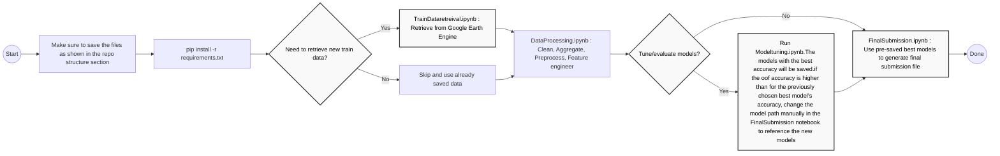

# GeoAI Challenge for Cropland Mapping in Dry Environments
This project contains the notebooks used for the zindi GEOAI Challenge for Cropland Mapping in Dry Environments.

Competition link : https://zindi.africa/competitions/geoai-challenge-for-cropland-mapping-in-dry-environments

## Project Overview
Advances in machine learning and artificial intelligence offer the potential to significantly improve cropland and land cover classification by leveraging time-series satellite imagery.
This challenge focuses on arid and semi-arid regions, where the primary difficulty lies in distinguishing cropland from pastures and steppe land. Participants are tasked with designing and evaluating methods for cropland mapping in two test regions:
   - Fergana, Uzbekistan – a densely cultivated region with complex irrigation patterns.
   - Orenburg, Russia – a semi-arid landscape where cropland is interspersed with steppe and pasture.
   
The project focuses on:
- Remote sensing data collection using Google Earth Engine
- Preprocessing large-scale geospatial datasets
- Building ML models for cropland classification

## OBJECTIVES
 1. Accuracy: Develop robust models that improve cropland classification compared to existing global products.

 2. Cost-effectiveness: Design methods that balance performance with computational efficiency and scalability.

 3. Regional Adaptability: Tackle the unique challenges of arid and semi-arid landscapes where cropland is hard to distinguish from pastures and steppe.

 4. Global Impact: Contribute to better agricultural monitoring and food security by enhancing global cropland mapping initiatives.

## Tech Stack
- Python (pandas, numpy, sklearn)
- Open API Usage : Google Earth Engine
- ML models : Logistic Regression, RandomForest, LightGBM, XGBoost

## Data Collection
The training data retrieval process is implemented in .

### Data Sources

Satellite imagery was retrieved using the **Google Earth Engine API** from the following Google Earth Engine collections:

- **Sentinel-1 SAR imagery**: `COPERNICUS/S1_GRD` - https://developers.google.com/earth-engine/datasets/catalog/COPERNICUS_S1_GRD
- **Sentinel-2 surface reflectance imagery**: `COPERNICUS/S2_SR_HARMONIZED` - https://developers.google.com/earth-engine/datasets/catalog/COPERNICUS_S2_SR_HARMONIZED

### Data Retrieval Process

The data collection workflow included:

- Authenticating and initializing access to Google Earth Engine.
- Loading training sample shapefiles for the study regions.
- Converting geospatial training points into Earth Engine `FeatureCollection` objects.
- Using the provided test dates to retrieve matching Sentinel-1 and Sentinel-2 observations.
- Filtering Sentinel-1 imagery by study area, date window, orbit direction, instrument mode, polarization, and relative orbit number.
- Retrieving Sentinel-1 radar backscatter features, including `VV` and `VH`.
- Filtering Sentinel-2 imagery by study area and date window.
- Applying cloud masking to Sentinel-2 imagery using the `QA60` cloud/cirrus band.
- Extracting Sentinel-2 spectral bands such as `B2`, `B3`, `B4`, `B8`, `B8A`, `B11`, and `B12`.
- Extracting metadata features such as cloud percentage, solar azimuth, and solar zenith.
- Sampling satellite values at the training point locations using Earth Engine.
- Exporting the retrieved data in chunks as CSV files to Google Drive to manage memory limitations.

The Google Earth Engine project name is user-specific and must be configured before running the notebook. Replace the placeholder project name with your own Google Cloud / Earth Engine project ID:

```python
ee.Initialize(project="your-google-earth-engine-project-id")
```
The retrieved Sentinel-1 and Sentinel-2 data was exported as structured CSV files and later used in the data processing and modelling pipeline. This step transformed raw satellite imagery into tabular features suitable for cropland classification.

---

## REPOSITORY STRUCTURE

```bash
GEO_AI_Cropland_Mapping_Challenge/
├─ EE_S1_Exports/
│  ├─ csv chunked data from sentinel 1
├─ EE_S2_Exports/
│  ├─ csv chunked data from sentinel 2
├─ EE_exports_S1_presaved/
│  ├─ previously extracted csv chunked data from sentinel 1
├─ EE_exports_S2_presaved/
│  ├─ previously extracted csv chunked data from sentinel 2
├─ Modelling_data/
│  ├─ test_data.csv
│  └─ train_data.csv
├─ raw_test_data/
│  ├─ Sentinel1.csv
│  ├─ Sentinel2.csv
│  └─ Test.csv
├─ raw_train_data/
│  ├─ train_S1.csv
│  ├─ train_S2.csv
│  ├─ Fergana_training_samples.dbf
│  ├─ Fergana_training_samples.shp
│  ├─ Fergana_training_samples.shx
│  ├─ Orenburg_training_samples.dbf
│  ├─ Orenburg_training_samples.shp
│  └─ Orenburg_training_samples.shx
├─ untuned_best_models/
│  ├─ folders containing the best models from each run of the untuned models
├─ tuned_best_models/
│  ├─ folders containing the best models from each run of the tuned models
├─ TrainDataretrieval.ipynb
├─ DataProcessing.ipynb
├─ ModelTuning.ipynb
├─ FinalSubmission.ipynb
├─ final_submission.csv
├─ requirements.txt
└─ README.md
```
## HOW TO RUN THE CODE
1. Make sure to save the files as shown above
2. Run 'pip install -r requirements.txt' (since we are using colab, each notebook has this code at the top before any imports.
3. Run `TrainDataretrieval.ipynb` to retrieve train data from google earth engine. In the notebook, authentication is required to connect to google eart engine. Once you run the cell for 'ee.authenticate', follow the pop up link to generate the required token.
4. Run `DataProcessing.ipynb` to clean,aggregate,preprocess and feature engineeer the train and test data.
  - Inorder to achieve the current leaderboard score, this file is currently set to load the csv files in the presaved datafiles folder. The data path can however be changed to read from 'EE_Exports_S1' and 'EE_Exports_S2' to use the latest extracted data from step 3.
5. Run `ModelTuning.ipynb` to evaluate the best models, otherwise skip this step to use pre-saved best models
6. Run `FinalSubmission.ipynb` using the best model folder path.

## ARCHITECTURAL DIAGRAM



### CODING ENVIRONMENT
- Google Colab (Free version) : The google drive is mounted at the start of each notebook. The main directory path is : "/content/drive/MyDrive/GEO_AI_Cropland_Mapping_Challenge/"
  
### NOTEBOOK RUNTIME
   1. TrainDataretrieval.ipynb - ~4 hours
   2. DataProcessing.ipynb - ~5 minutes
   3. ModelTuning.ipynb - ~25 minutes (due to hyperparameter tuning)
   4. FinalSubmission.ipynb - ~10 seconds

## ETL PROCESS
** Assumptions**
- Cropland exhibits distinct seasonal amplitude and timing, even when absolute greenness is modest in drylands.
- Training and test data come from related but not identical distributions (region/seasonal shift); mitigate with region-aware validation and simple domain controls.
  
### 1. EXTRACT
 1. Train data
- The provided shp files were used to extract sentinel 1 and 2 data from google earth engine (s1 : COPERNICUS/S1_GRD, s2: COPERNICUS/S2_SR_HARMONIZED).
- The train data was extracted using the dates available on the test data
- Due to memory limitations, the data was retrieved in chunks and the netebook saves the files directly to google drive

 2. Test Data
- As the provided geolocations were masked, the test data used relied on the provided sentinel 1 and 2 data.

- Data Description :
   - Sentinel 1 data : focuses on radar data
   - Sentinel 2 data: high spatial resolution optical mission data

### 2. TRANSFORMATION
  #### 2.1 CLEANSING
  - Drop duplicates
  - Drop coordinate columns as these columns are masked on the test data thus may not bave relevant modelling information
    
  #### 2.2 AGGREGATION
   - s1_columns : `[['VH', 'VV','orbit', 'polarization', 'rel_orbit', 'region', 'month']`
   - s2_columns :
     i.) band_cols = `['B11','B12','B2','B3','B4','B5','B6','B7','B8','B8A']`
     ii.) meta_cols = `['cloud_pct','solar_azimuth','solar_zenith']`
   - The extracted and provided data was at a daily granular level. This was aggregated to ID-Region-Month level.
   - For S1 data, the following aggregations were taken :
        - `{'VH':'mean','VV':'mean',
            'orbit':lambda x: x.mode()[0],
            'polarization': lambda x: x.mode()[0],
            'rel_orbit': lambda x: x.mode()[0]}}`
   - S2 data was aggregated as follows:
        -`{**{b: 'median' for b in band_cols},
           'cloud_pct': 'median',
           'solar_azimuth': 'median',
           'solar_zenith': 'median'}`
   - The aggregated s1 and s2 data were then combined for both the train and test data.

   #### 2.3 PRE-PROCESSING
   - clip outliers using the 25 and 75 quantile values
   - Apply quantile mapping to reduce covariate shift between the train and test data
   - Apply robust scaling
   - Encode region column

   #### 2.4 FEATURE ENGINEERING
   - Develop vegetation indices (calculated using the band columns)
   - Add targeted seasonal features
   - Create ratio and difference features using S1 data
   - The data table is transformed from a long format (ID-Region-Month) to a wide format (ID-Region). Thi creates one row per ID with columns at time series monthly level
   - Indices like TVI (Triangular Vegetation Index) and TGI (Triangular Greenness Index) have wide ranges thus we clip to reduce the noise level.
   - Run a correlation check to eliminate correlation features. This reduces the dataframe size from 713 to 514
  
   #### 2.5 FEATURE LIST
   - 'ID' : Unique identifier
   - 'region' : The region for the data point ( Fergana or Orenburg)
   - 'month' : Month of the year for the specific data point
   
   Raw Bands : 
    - 'B11','B12' : SWIR reflectance (moisture, soil, burn, mineral)
    - 'B2': Blue reflectance (atmosphere/water penetration)
    - 'B3': Green reflectance (vegetation “green peak”)
    - 'B4': Red reflectance (chlorophyll absorption)
    - 'B5','B6','B7' : Red-edge reflectance (chlorophyll/leaf structure sensitive)
    - 'B8', 'B8A' : NIR reflectance (biomass/leaf structure)
    
   Sar Channels :
    - 'VH': Sentinel-1 backscatter (cross-pol); vegetation volume/structure
    - 'VV' : Sentinel-1 backscatter (co-pol); geometry/roughness/moisture
    - 'vh_vv_ratio' : Ratio VH/VV (phenology & moisture sensitive)
    - 'vh_minus_vv' : VH − VV (difference highlighting structure)
   
   Core Vegetation Indices : 
    - 'GNDVI': Green NDVI: (B8 - B3)/(B8 + B3) — more sensitive to chlorophyll/nitrogen
    - 'EVI2' : Two-band EVI: 2.5*(B8 - B4)/(B8 + 2.4*B4 + 1) — EVI without blue band
    - 'NGRDI': Normalized Green-Red Diff.: (B3 - B4)/(B3 + B4) — RGB greenness contrast
    - 'WDRVI' : Wide Dynamic Range VI: (α*B8 - B4)/(α*B8 + B4) (α≈0.1–0.2) — keeps sensitivity at high biomass.
    - 'EVI' : Enhanced VI: 2.5*(B8 - B4)/(B8 + 6*B4 - 7.5*B2 + 1) — reduces soil/atmosphere effects
    - 'NDVI' : Normalized Difference Vegetation Index - (B8 - B4)/(B8 + B4) — canopy greenness/LAI proxy
    - 'TNDVI' : Transformed NDVI (common form): sqrt(NDVI + 0.5) — smoothed greenness scale
    - 'VDVI' : Visible-band DVI: (2*B3 - B4 - B2)/(2*B3 + B4 + B2) — greenness from RGB only
    - 'TVI' : Transformed VI: sqrt((B8 - B4)/(B8 + B4) + 0.5) — contrast-enhanced NDVI transform
    - 'EXG': Excess Green: 2*B3 - B4 - B2 (or normalized variants) — vegetation from RGB
    - 'RDVI': Renormalized DVI: (B8 - B4)/sqrt(B8 + B4) — linearizes NDVI vs. biomass
    
   Soil-adjusted & soil-related:
    - 'BSI' : Bare Soil Index: `((B11 + B4) - (B8 + B2))/((B11 + B4) + (B8 + B2))` — bare ground vs veg
    - 'SAVI' : Soil-Adjusted VI: `(1+L)*(B8 - B4)/(B8 + B4 + L) (L≈0.5)` — reduces soil background
    - 'PVI' : Perpendicular VI: `(B8 - a*B4 - b)/sqrt(1+a^2)` (uses soil-line slope a, intercept b)
    - 'OSAVI' : Optimized SAVI: `(B8 - B4)/(B8 + B4 + 0.16)` — fixed L=0.16
    - 'SI' : Shadow Index: `((1 - B2)*(1 - B3)*(1 - B4))^(1/3)` — self-shadowing detection
   
   Water / moisture:
    - 'NDWI' : (McFeeters water bodies): `(B3 - B8)/(B3 + B8)` — surface water highlight
    - 'MNDWI' : Modified NDWI (Xu): `(B3 - B11)/(B3 + B11)` — suppresses built-up, enhances water
    - 'NDMI' : (aka NDWI-Gao vegetation water): `(B8 - B11)/(B8 + B11)` — canopy moisture
    - 'MI' : Moisture Stress Index (often labeled MI/MSI): `B11/B8` — higher values = drier canopy
   
   Red-edge & chlorophyll proxies:
    - 'NDRE' : Red-edge NDVI: `(B8 - B5)/(B8 + B5)` — chlorophyll at higher LAI
    - 'NDVIre' : NDVI with red-edge (one common S2 form): `(B8A - B6)/(B8A + B6)` — greenness using RE
    - 'CIre' ; Chlorophyll Index (red-edge): `(B8/B5) - 1`
    - 'RENDVI' : Red-edge NDVI (705/750 nm): `(B6 - B5)/(B6 + B5)` — stress/Chl changes
    - 'CCCI' : Canopy Chl Content Index: `NDRE / NDVI` — chlorophyll normalized by greenness
    - 'MCARI' : Modified Chlorophyll Absorption Ratio Index: `((B5 - B4) - 0.2*(B5 - B3))*(B5/B4)` — chlorophyll/structure
    - 'MTCI' : MERIS Terrestrial Chl Index (S2 approx.): `(B6 - B5)/(B7 - B6)` — canopy chlorophyll
    - 'S2REP' : S2 Red-Edge Position (nm): `705 + 35 * (((B7 + B4)/2 - B5)/(B6 - B5))` — pigment/Chl shift
   
   Pigments / senescence / stress : 
    - 'ARVI': Atmospherically Resistant VI: `(B8 - (2*B4 - B2))/(B8 + (2*B4 - B2))` — aerosol-robust greenness
    - 'SIPI' : Structure-Insensitive Pigment Index: `(B8 - B1)/(B8 - B4)` (common variant uses blue instead of aerosol: (B8 - B2)/(B8 - B4)) — carotenoids vs chlorophyll (stress)
    - 'PSRI' : Plant Senescence Reflectance Index: `(B4 - B2)/B6` — carotenoid/chl ratio, senescence
   
   Yellowness / flowering (useful in drylands & croplands)  
    - 'RYI' ; Ratio Yellowness Index (common in flowering studies; exact variant differs by paper, e.g., green/blue or red/yellow ratio)
    - 'NDYI' : Normalized Difference Yellowness Index: `(B3 - B2)/(B3 + B2)` — blooming/yellow flowers (canola, trees)
    - 'DYI' : Difference Yellowness Index: `(B3 - B2)` — simple green–blue difference for yellowing
   
   Water/ice & burn:
    - 'BAI' ; Burn Area Index: `1/((0.1 - B4)^2 + (0.06 - B8)^2)` — highlights burned targets
    - 'NDSI' : Normalized Difference Snow Index: `(B3 - B11)/(B3 + B11)` — snow/ice masking
    - 'NBR' : Normalized Burn Ratio: `(B8 - B12)/(B8 + B12)` — burn severity; post-fire differencing often used
     
   Others:
     - 'MMSR' : Typically refers to a Modified (Modified) Simple Ratio variant using red-edge bands; a common related index is MSR705
     - 'TGI' : Greenness proxy using only visible bands
     - 'GCVI' : Estimates chlorophyll content; more sensitive than NDVI in high biomass
     - 'ACI' : Indicates red pigmentation (anthocyanins) in vegetation, used in stress or senescence studies
     - 'CVI' : Highlights chlorophyll by combining NIR, red, and green
     - 'AVI' : Non-linear vegetation index to emphasize high biomass
     - 'NPCRI' : Proxy for chlorophyll/carotenoid ratio; higher = more carotenoids or senescence
     - 'TCARI': Refines chlorophyll detection, reducing background/LAI effects
    
### 3. LOAD
The final datasets are saved as csv files :
 1. train_data.csv
 2. test_data.csv

## DATA MODELLING
Task : Binary classification: distinguish cropland from pasture/steppe in arid & semi-arid settings.
- Due to the difference in region characteristics, each region was modelled separately
- Pipeline steps included :
    1. Imputer - SimpleImputer(mean)
    2. Sampler - RandomOverSample (Applied on Orenburg region only)
    3. Scaler - StandardScaler
    4. Feature_selection - use selectKBest(k=60)
- Models used (at random state 42):
    1. Random forest
    2. Logistic Regression
    3. LightGBM
    4. XGBoost
       
  ### TRAINING PROCESS
  - StratifiedKFold used for cross validation
  - No tuning : The data was first trained on fixed models with default parameters and the best models with the highest out-of-fold accuracy were saved
  - Hypeparameter tuning : using randomsearchCV on declared parameter spaces
  - Thresholding : default threshold at 0.5
  - evaluation metric:mean accuracy score, regional accuracy scores
  - Model selection: pick by primary metric on Out-of-Fold-Accuracy
  - complexity control : selected features capped at 60
  - output feature importance visual
  - A metadata json file is also saved showing the models chosen, features used, saved model path and accuracy scores
  VERSIONING : the models and metadata folder is saved using the timestamp of model run

### FINAL MODEL INFERENCE
  - The best modelling pipeline (from both untuned and tuning stage) are retrained on the whole train data set.
  - The submission files are saved as csv files.
  - The submission file from the pipeline with the highest out-of-fold-accuracy(either from the no tuning stage or the tuning stage) is the submitted

### PERFORMANCE METRICS
- Overall out-of-fold-accuracy : 0.869
- Region 0 (Fergana) :
   - best_model : 'XGBoost'
   - oof_accuracy : 0.922
   - n_sampled : 500
- Region 1 (Orenburg) :
   - best_model : 'Random Forest'
   - oof_accuracy : 0.816
   - n_sampled : 500
- Submission file target counts : Region 0 - 396, Region 1 - 204
- Submission ID : 8JnGXiMB
- Public Leaderboard score : 0.883333333
- Private Leaderboard score  0.838095238
  
## MAINTENANCE,MONITORING AND LIFECYCLE MANAGEMENT:
-There is still an opportunity for improving the model and some way to increase its scalability would be:
   1. Running an isolation forest to identify anomalies in the dataset(was noted to improve the model in later versions)
   2. Increasing the number of features to be used during modelling (Increasing from k=60 to k=110 improved later versions of the model)
   3. Regularly evaluate feature importances and monitor for degraded signal (e.g., vegetation indices underperforming during dry seasons).
      
- To manage the model life cycle, it would be of convenience to extract and retrain the model every quarter using the latest samples.
- All model folders can be saved under semantic versions using the creation timestamp (e.g.,untuned_best_models/1759299893986/).Each folder contains :
    1. The best pkl model file per region
    2. metadata json file
    3. submission file of the predicted output using the models

 ## MODELLING LIMITATIONS
 - Due to time complexities, catboost was not tested as it took a long time to run especially during hyperparameter tuning
 - In addition, it would be worthwhile to try other parameter tuning techniques like grid search

   ### CAVEATS
- While the currently selected model achieved our highest public leaderboard score, its score dropped on the private leaderboard. Conversely, some earlier submissions with lower public scores outperformed it on the private set. This could suggest mild overfitting to the public subset.
